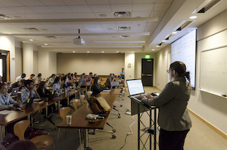

# 2019 HudsonAlpha BioTrain Computational Biology Bootcamp

**Logistics**: The Bootcamp is Monday, June 3, 2019 in the McCrary Teaching Lab on the second floor of the Paul Propst Center (800 Hudson Way) from 8a - 4:30p

**Objective/Rationale:** This one day workshop is intended to provide HudsonAlpha BioTrain interns and graduate rotation students an introduction to computational biology through a discussion on why computers are necessary in genomics, short unix shell and R tutorials followed by hands-on exercises [The Carpentries lessons](https://carpentries.org/), and tips on how to ask for help, keeping a computational lab notebook, and finding additional learning resources. 

**Prerequisites**: Curiosity about computational biology and a basic understanding of the ideas of files and directories (folders). Access to a laptop (talk to Michelle Morris if you need to borrow one). Ability to use your favorite web browser to download and install the necessary software and data (see below).

### May 30, 2019 & May 31, 2019:
**Lunch**: Computer set-up. James and/or Bryan will be around to help make sure computers are set up for next week.

### June 3, 2019:

**8am-9am**: Computer set-up This can be done anytime before bootcamp begins, but helpers will be available during this hour.

[Detailed Windows Setup Instructions](#detailed-windows-setup-instructions)

Please ensure you have the following software and data on the computer you intend to use during the workshop:
1. Make sure you have access to a [Bash Shell](http://swcarpentry.github.io/shell-novice/setup.html) (use [Git BASH](https://gitforwindows.org/) for Windows); and download the [data-shell.zip](http://swcarpentry.github.io/shell-novice/setup.html) file
2. Install: 
  * a) [R Programming Language](https://cloud.r-project.org/)
  * b) [RStudio Desktop](https://www.rstudio.com/products/rstudio/download/#download) 
  * c) download the [r-novice-inflammation](https://swcarpentry.github.io/r-novice-inflammation/setup.html) data

**9am-9:50am**: Bootcamp Introduction & An Introduction to Biology with Computers  
*James Lawlor and Bryan Moyers*

**9:50am**: Break

**10am-12pm**: Introduction to the Unix Shell  
*James Lawlor*

* [Introducing the Shell](http://swcarpentry.github.io/shell-novice/01-intro/)
* [Navigating Files and Directories](http://swcarpentry.github.io/shell-novice/02-filedir/)
* [Working with Files and Directories](http://swcarpentry.github.io/shell-novice/03-create/)
* **Stretch Goal**: Demo [Pipes](http://swcarpentry.github.io/shell-novice/04-pipefilter/index.html) and [Loops](http://swcarpentry.github.io/shell-novice/05-loop/index.html)

**12pm-12:30pm**: Keeping a Computational Lab Notebook & How to Get Programming Help (slides)  
**Aside**: Accessing the HudsonAlpha Compute Cluster  
*James Lawlor*

**12:30pm-1:30pm**: Lunch

**1:30pm-4:00pm**: Programming with R  
*Bryan Moyers*

* [Analyzing Biology Data](http://swcarpentry.github.io/r-novice-inflammation/01-starting-with-data/)
* [Writing Functions](http://swcarpentry.github.io/r-novice-inflammation/02-func-R/)
* [Analyzing Multiple Data Sets](http://swcarpentry.github.io/r-novice-inflammation/03-loops-R/)

**4pm-4:30pm**: What Now? (Continued Learning) (slides)

### More Practice :
See the "What Now?" slides above.

Check these shell lessons out if you:
* want to combine existing shell commands: [Pipes and Filters](http://swcarpentry.github.io/shell-novice/04-pipefilter/index.html)
* perform the same action on many files in the shell: [Loops](http://swcarpentry.github.io/shell-novice/05-loop/index.html)
* need to save and reuse shell commands: [Shell Scripts](http://swcarpentry.github.io/shell-novice/06-script/index.html)

Check these R lessons out if you:
* [want to practice more R programming with the inflammation data set used during bootcamp](http://swcarpentry.github.io/r-novice-inflammation/)
* [are interested in R programming lessons for reproducible scientific analysis](https://datacarpentry.org/lessons/)

### Windows-Specific Tips & Gotchas
* Copy & Paste:
  * On windows, you are used to `ctrl+c` and `ctrl+v` to copy and paste. This will not work in Git-Bash window because `ctrl+c` and `ctrl+v` have different meanings in Unix
  * To copy:
    * Select text in the git-bash window with the mouse, and it will automatically be copied
    * Or, use the left-click menu
    * Use `ctrl+insert` (some laptops may not have this as a separate key)
  * To paste:
    * Click with the middle mouse button
    * Or, use the left-click menu
    * Use shift+insert (some laptops may not have this as a separate key)
* Git-Bash represents Windows-style paths (with backslashes, `\`), like `C:\Users\James`, in the Unix style (with forward slashes, `/`), like `/c/Users/James`
* The `ls` command should work on Git-Bash 2.2.1.0, but if not, use `dir`
* Unzipping `data-shell.zip`: You want to end up with a folder on your Desktop called `data-shell`, and inside it, folders like `creatures` and `molecules` and files like `notes.txt`. Some versions of Windows may automatically unzip the file such that you have a folder `data-shell` inside another folder called `data-shell` which may become confusing. See "Detailed Windows Setup Instructions" below.

### Detailed-Windows-Setup-Instructions
1. Download the [Git for Windows](https://gitforwindows.org/) installer (version 2.2.1.0). The download link should automatically choose the right installer for your version of Windows.
2. Navigate to your Downloads folder and run the installer.
3. Git 2.2.1.0 Setup: Use the default options in the "Select Components" screen. Choose the Nano editor for the default editor. Use the default options in the following screens.

### Acknowledgements
**Presenters:**
 - James Lawlor, Computational Biologist in the Greg Cooper Lab at HudsonAlpha
 - Bryan Moyers, Postdoctoral Researcher in the Rick Myers Lab at HudsonAlpha

**Course Development**  
Course content adapted from the Software Carpentries lessons and the 2018 Bootcamp organized by [Brittany Lasseigene, PhD](https://www.lasseigne.org), Assistant Professor at the [University of Alabama in Birmingham](https://www.uab.edu/home/)
