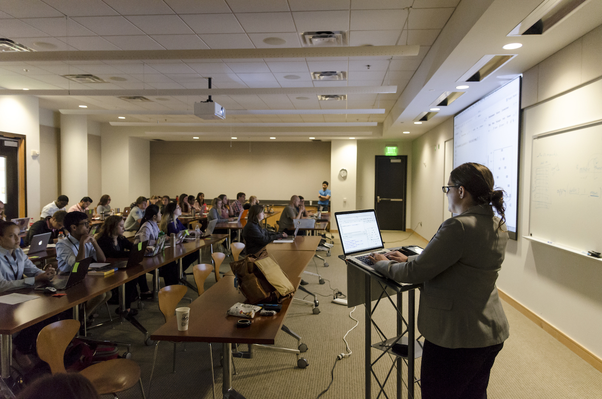

# 2023 HudsonAlpha BioTrain Computational Biology Bootcamp


**Webpage Updates**
- 05/23/2023:
  - Deployed website for 2023
- Changes from last year:
  - 

**Logistics**: The Bootcamp is Wednesday, May 31, 2023 and Thursday, June 1, 2023 (two half-days) in the Chan Teaching Lab on the second floor of the Paul Propst Center (800 Hudson Way) from 8:00am - 12:15pm each day.

**COVID-19 Safety**: We will follow the current Institute guidelines for COVID-19 based on the current CDC status for our area. Masks will be optional for students.

**Objective/Rationale:** This one day workshop is intended to provide HudsonAlpha BioTrain interns and graduate rotation students an introduction to computational biology through a discussion on why computers are necessary in genomics, short unix shell and R tutorials followed by hands-on exercises [The Carpentries lessons](https://carpentries.org/), and tips on how to ask for help, keeping a computational lab notebook, and finding additional learning resources.

**Prerequisites**:
- Curiosity about computational biology and a basic understanding of the ideas of files and directories (folders).
- Access to a laptop (talk to Michelle Morris if you need to borrow one).
- Ability to use your favorite web browser to download and install the necessary software and data (see below).

**Presenters:**
- [James Lawlor](mailto:jlawlor@hudsonalpha.org) (he/him), Computational Biologist in the Greg Cooper Lab at HudsonAlpha
- [Belle Moyers](mailto:bmoyers@hudsonalpha.org), (she/her) Senior Scientist in the Rick Myers Lab at HudsonAlpha

**Course Development**
Course content adapted from the Software Carpentries lessons and the 2018 Bootcamp organized by [Brittany Lasseigene, PhD](https://www.lasseigne.org), Assistant Professor at the [University of Alabama in Birmingham](https://www.uab.edu/home/)

### Wednesday, May 31, 2023:

**8:00am - 8:15am**: Computer set-up.

[Detailed Windows Setup Instructions](#detailed-windows-setup-instructions)

[Mac: Changing your shell to bash](#setting-up-bash-shell-on-mac)

#### Data Setup
We will download the "shell lesson data" together as a group using the shell so that we can make sure it lands in a consistent location.
We will use the following commands:
```
curl --output shell-lesson-data.zip https://swcarpentry.github.io/shell-novice/data/shell-lesson-data.zip

curl --output r-novice-inflammation.zip https://swcarpentry.github.io/r-novice-inflammation/data/r-novice-inflammation-data.zip

unzip shell-lesson-data.zip

unzip r-novice-inflammation.zip
```
Copy and paste the first line into a terminal window and hit enter. Continue with the other commands in order. You don't need to worry about remembering or understanding what we're doing at this point.


Please ensure you have the following software and data on the computer you intend to use during the workshop:
1. Make sure you have access to a [Bash Shell](http://swcarpentry.github.io/shell-novice/setup.html) (use [Git BASH](https://gitforwindows.org/) for Windows; Terminal is the built-in program for Mac, however we will need to change the shell to bash)
2. Install:
  * a) [R Programming Language](https://cloud.r-project.org/)
  * b) [RStudio Desktop](https://www.rstudio.com/products/rstudio/download/#download)
3. Using the bash shell, we will all walk through downloading the lesson data together. See above under "Data Setup"


**8:15am - 9:15am**: Bootcamp Introduction & An Introduction to Biology with Computers and James Lawlor Computational Research  
(slides: [Biotrain-2022-Intro-Comp-Bio.pptx](Biotrain-2022-Intro-Comp-Bio.pptx))  
*James Lawlor and Belle Moyers*

**8:00am - 8:30am** James Lawlor Computational Research  
(slides: [Biotrain-2022-GCooper-Lab.pptx](Biotrain-2022-GCooper-Lab.pptx))  
*James Lawlor*

**8:30am - 8:45am** Keeping a Computational Lab Notebook  
(slides: [Lab-Notebook.pptx](Lab-Notebook.pptx))  
*James Lawlor*


**8:45-9:45**: Introduction to the Unix Shell  
*James Lawlor*

* [Introducing the Shell](https://swcarpentry.github.io/shell-novice/01-intro.html)
* [Navigating Files and Directories](https://swcarpentry.github.io/shell-novice/02-filedir.html)

**9:45am - 10:00am**: Break


**10:00 - 11:45am**: Unix Shell Continued  
*James Lawlor*

* [Working with Files and Directories](https://swcarpentry.github.io/shell-novice/03-create.html)
* **Stretch Goal**: Demo [Pipes](https://swcarpentry.github.io/shell-novice/04-pipefilter.html) and [Loops](https://swcarpentry.github.io/shell-novice/05-loop.html)

**11:45am - 12:15pm**: What Now? (Continued Learning) (slides: [What-Now-Continued-Learning.pptx](What-Now-Continued-Learning.pptx))  
*James Lawlor*


## Thursday, June 1, 2023:

**8:15am - 9:15am** Belle Moyers Computational Research (Slides)

**9:15am - 10:15am**: Programming with R  
*Belle Moyers*
* [Analyzing Biology Data](http://swcarpentry.github.io/r-novice-inflammation/01-starting-with-data.html)
* [Writing Functions](http://swcarpentry.github.io/r-novice-inflammation/02-func-R.html)
* [Loops](http://swcarpentry.github.io/r-novice-inflammation/03-loops-R.html)


**10:15am - 10:30am**: Break

**10:30am - 11:30am**: Programming with R, continued  
*Belle Moyers*

**11:30am - 12:15pm**: How to Get Programming Help  
(slides: [Getting-Programming-Help_2022.pptx](Getting-Programming-Help_2022.pptx))  
*Belle Moyers*


### More Practice :
See the "What Now?" slides above.

Check these shell lessons out if you:
* want to combine existing shell commands: [Pipes and Filters](https://swcarpentry.github.io/shell-novice/04-pipefilter.html)
* perform the same action on many files in the shell: [Loops](https://swcarpentry.github.io/shell-novice/05-loop.html)
* need to save and reuse shell commands: [Shell Scripts](https://swcarpentry.github.io/shell-novice/06-script.html)


Check these R lessons out if you:
* [want to practice more R programming with the inflammation data set used during bootcamp](http://swcarpentry.github.io/r-novice-inflammation/)
* [are interested in R programming lessons for reproducible scientific analysis](https://datacarpentry.org/lessons/)

Other useful resources:
* [Codeacademy: Learn the Command Line](https://www.codecademy.com/learn/learn-the-command-line)
* [LinuxCommand.org](http://linuxcommand.org)
* [Coursera: Unix Workbench](https://www.coursera.org/learn/unix)
* [DataCamp: Introduction to R](https://www.datacamp.com/courses/free-introduction-to-r)
* [ExplainShell.com](https://explainshell.com/) - Breaks down and explains shell commands you enter
* [Hitchhiker's Guide to Python](https://docs.python-guide.org/)
* [Regular Expression Tester & Debugger](https://regex101.com/)
* [R for Data Science](https://r4ds.had.co.nz/)
* [The BioStar Handbook](https://www.biostarhandbook.com/)
* [Book: Bioinformatics Data Skills](http://shop.oreilly.com/product/0636920030157.do)
* [EBI Next-Generation Sequencing Practical Course](https://www.ebi.ac.uk/training/online/course/ebi-next-generation-sequencing-practical-course)


### Windows-Specific Tips & Gotchas
* Copy & Paste:
  * On windows, you are used to `ctrl+c` and `ctrl+v` to copy and paste. This will not work in Git-Bash window because `ctrl+c` and `ctrl+v` have different meanings in Unix
  * To copy:
    * Select text in the git-bash window with the mouse, and it will automatically be copied
    * Or, use the left-click menu
    * Use `ctrl+insert` (some laptops may not have this as a separate key)
  * To paste:
    * Click with the middle mouse button
    * Or, use the left-click menu
    * Use shift+insert (some laptops may not have this as a separate key)
* Git-Bash represents Windows-style paths (with backslashes, `\`), like `C:\Users\James`, in the Unix style (with forward slashes, `/`), like `/c/Users/James`
* The `ls` command should work on Git-Bash, but if not, use `dir`


### Detailed-Windows-Setup-Instructions
1. We will be installing the most recent versions of all the software listed. Most likely, the exact version numbers won't be important, but version numbers from May 2023 are listed below for clarity. Most versions of Windows will ask "do you want to allow this program to make changes to your computer" when you're installing software. We will use default options on the install wizards.
2. Download the [Git for Windows](https://gitforwindows.org/) installer (version 2.40.1). The download link should automatically choose the right installer for your version of Windows. Navigate to your Downloads folder and run the installer.
3. Git 2.40.1 Setup: Use the default options in the "Select Components" screen and "Select Start Menu Folder". Use the default options in the following several screens. *You may want to check "Additional Icons -> On the Desktop" to easily find this later.*
4. Install R: [R Programming Language](https://cloud.r-project.org/). Click links for "Download R for Windows" and then "install R for the first time" and then the "Download R 4.1.0 for Windows" link to download the file. Navigate to your Downloads folder and run the installer. You will need to allow the installer to make changes to your computer, and you do not need to change any of the default installation options.
5. Install RStudio: [RStudio Desktop](https://www.rstudio.com/products/rstudio/download/#download). Choose the download link "Download RStudio For Windows". (This should work on Windows systems from the past several years.)
6. Use the Start Menu or Desktop icon to open Git Bash
7. Download 

### Setting up Bash Shell on Mac
1. A few years ago, MacOS changed the default shell to `zsh` instead of `bash`. The two are similar, but for clarity we will use bash.
2. Open the Terminal app
3. At the prompt, type `bash` and hit enter.
4. If you want to change your default shell to bash, so that you don't have to type the bash command every time you use terminal, follow steps 5-8.
5. At the prompt, type `chsh -s /bin/bash` and hit enter. You should see "changing shell for <username>"
6. You will be asked to enter your password, then hit enter. If there are no errors, you will be back at the prompt.
7. Close Terminal and then re-open. You should see in the title bar of the window that it says "Terminal -- -bash"
8. **Note**: This change will persist for your user profile. If you want to change it back after the bootcamp, you will use the command `chsh -s /bin/zsh`

### Setting up R and RStudio on MacOS
1. Click on the Mac icon at the top left of your menu bar and choose "About this Mac". Under "Processor" look for whether it says Intel or M1. (M1 is found only on brand-new systems.) Then close the window.
2. Go to the Apple menu and select "About this mac" and look under Processor. Note whether you have an Intel process or an M1 or M2 (ARM) processor. 
3. Go to [R Programming Language](https://cloud.r-project.org/) and select "Download R for MacOS". On this page, choose the first option `R-4.1.0.pkg`if you have an Intel processor. Choose the second option `R-4.1.0-arm64.pkg ` if you have a M1 or M2 processor.  
3. Open the pkg file from your Downloads folder and click through the installation wizard with default options. You may need to enter your password.
4. Go to [RStudio Desktop](https://www.rstudio.com/products/rstudio/download/#download). Click "Download RStudio for Mac".
5. Open the pkg file. You will see a window open up with an RStudio icon which you will drag into the applications folder.
6. Use the launchpad to open Rstudio. You may see a notification that Rstudio was downloaded from the internet. If so, click "open".
